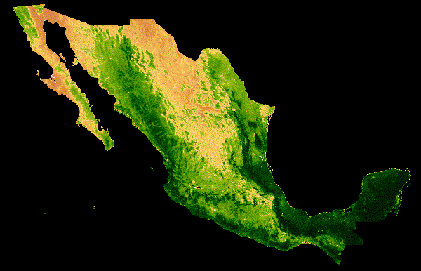

# Mexico:  20-year median NDVI animation

In this repo, a script is created to create an animated GIF of Mexico that displays the 20-year median NDVI over a 1-year time span.  The NDVI, Normalized Difference Vegetation Index, is a reflectance-based vegetation index that is calculated using Near-Infrared and Red bands.  Because healthy vegetation has high reflectance in the Near Infared band, which is not visible with the human eye, this normalized difference ratio highlight vegetation productivity.  Google Earth Engine (GEE) is the software used to import the NDVI values over this 20 year timespan and excecute the code.  The dataset used in this code is the MODIS Satellite Terra Vegetation Indicies 16-day Global 1 km dataset where NDVI is precalculated.

## The Code

The script, MODIS_20yrNDVI_gif.js, is a javascript code that can be imported into GEE to create the animated output.  The following are the steps within this code:

1.  The NDVI band is selected from the MODIS Terra Vegetation Indicies 16-day Global 1 km dataset.
2.  A mask variable is assigned to the Mexico country border using Large Scale International Boundary dataset which contains country boundaries and a region is imported for the extent of the animation frame.
3.  The images within our NDVI image collection are grouped by the Day of Year in which the image was collected and lists of NDVI images are created for each day of the year over 365 days.
4.  Within each of these Day of Year groups, the median NDVI is calculated across all pixels as to have 365 median NDVI raster.
5.  Vizualization parameters are created to best display NDVI and each Day of Year median NDVI is mapped to these parameters and clipping the extent to the Mexico boundary mask.
6.  The .gif parameters are set using the region defined earlier as the extent, with appropriate dimensions and coordinate system, and the desired frames per second in our animation.
7.  Lastly, the .gif is exported to the GEE console using the defined .gif parameters. 

# Output Animation

The output of this script is below which shows the median NDVI for a 20 year timespan for each day of the year:

> 

## Observations  

I chose Mexico for this exercise because of the country's large geographic extent and diversity of vegetation and climates.  I found it interesting that the peak median NDVI differs depending on the area of the country in which one is examining.  When looking at the latitude that stretches from southern Baja Peninsula across the mainland, there are three different peaks.  The first occurs on the eastern Gulf coast, followed by the central mainland, and lastly on the peninsula.

